Hi there 👋

### 📈 Activity & Consistency

<picture>
  <source media="(prefers-color-scheme: dark)" srcset="dist/github-snake-dark.svg">
  <source media="(prefers-color-scheme: light)" srcset="dist/github-snake.svg">
  
</picture>

### 📊 Technical Stack & Metrics

